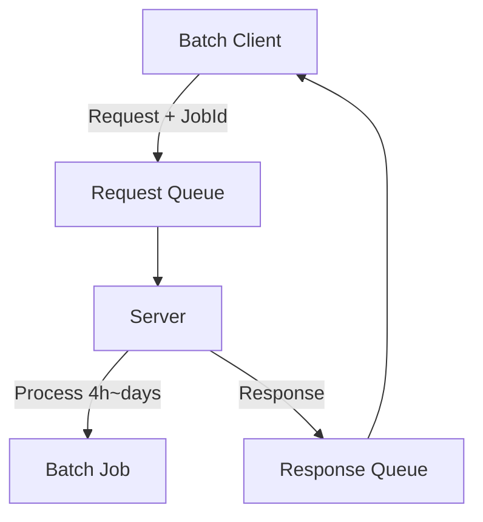

# Azure Service Bus Job을 활용한 장시간 배치 작업 처리

## 개요
이 프로젝트는 Azure Service Bus의 Job 기능을 사용하여 장시간 실행되는 배치 작업을 처리하는 시스템을 구현합니다.

## 주요 특징
- 장시간(4시간~수일) 실행되는 작업 처리
- Public endpoint가 없는 클라이언트 지원
- 안정적인 메시지 전달 보장
- 동시에 여러 작업 처리 가능

## 시스템 구성


## 설치 방법
1. 필요한 패키지 설치
```bash
python3.10 -m venv .venv
source .venv/bin/activate
pip install -r requirements.txt
```
2. 환경 변수 설정
```bash
export SERVICEBUS_CONNECTION_STRING="..."
export SERVICEBUS_REQUEST_QUEUE_NAME="..."
export SERVICEBUS_RESPONSE_QUEUE_NAME="..."
```

## 사용 방법
### 서버 실행
```bash
python app/server.py
```
### 클라이언트 실행
```bash
python app/client.py
```

## 주요 기능
1. 세션 기반 메시지 처리
    - 각 요청은 고유한 세션 ID로 처리
    - 응답이 정확한 클라이언트에게 전달됨
2. 비동기 처리
    - 여러 작업을 동시에 처리
    - 리소스 효율적 사용
3. 오류 처리
    - 네트워크 오류 자동 복구
    - 메시지 손실 방지
    - 메시지 처리 중 에러 발생 시 메시지를 dead letter 큐로 이동

## 기술 스택
- Python 3.10+
- Azure Service Bus
- asyncio

## 제약사항
- Service Bus 큐에 세션 활성화 필요
- 모든 메시지는 세션 ID 포함 필요

## 라이선스
MIT License

## 기여 방법
1. Fork the Project
2. Create your Feature Branch
3. Commit your Changes
4. Push to the Branch
5. Open a Pull Request

## 문의사항
GitHub Issues를 통해 문의해주세요.
