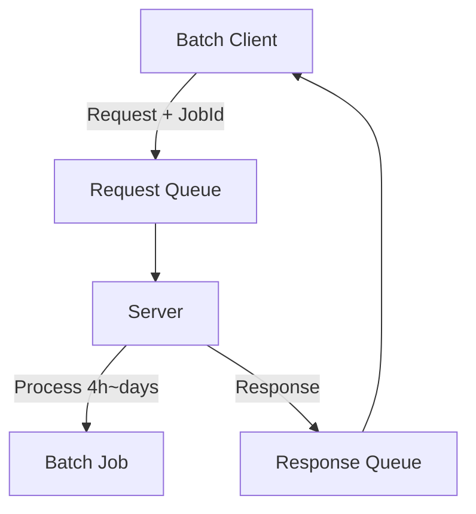

# Long-running Batch Job Processing Using Azure Service Bus

## Overview
This project implements a system for processing long-running batch jobs using Azure Service Bus Job functionality.

## Key Features
- Processing of long-running tasks (hours to several days)
- Support for clients without public endpoints
- Guaranteed reliable message delivery
- Ability to process multiple jobs asynchronously

## System Architecture


## Installation

1. Install required packages
```bash
git clone https://github.com/ampersandor/session-batch.git
cd session-batch
poetry shell
poetry install
export PYTHONPATH=$(pwd)
```
2. Set environment variables

you can use .env file or set environment variables
```bash
export SERVICEBUS_CONNECTION_STRING="..."
export SERVICEBUS_REQUEST_QUEUE_NAME="..."
export SERVICEBUS_RESPONSE_QUEUE_NAME="..."
export BATCH_ACCOUNT_NAME="..."
export BATCH_ACCOUNT_KEY="..."
export BATCH_ACCOUNT_URL="..."
export BATCH_MOUNT_PATH="..."
export POOL_ID="..."
export REDIS_HOST="..."
export REDIS_PORT="..."
export REDIS_PASSWORD="..."
export PGSQL_USER="..."
export PGSQL_PASSWORD="..."
export PGSQL_DATABASE="..."
export PGSQL_PORT="..."
export PGSQL_URL="..."
export TEAMS_WEBHOOK_URL="..."
export SERVER_MOUNT_PATH="..."
export BLOB_URL="..."
```

## Usage
### Running the Server
```bash
poetry run python src/app/server.py
```
### Running the Client
```bash
poetry run python src/app/client.py
```

## Core Features
1. Session-based Message Processing
    - Each request is processed with a unique session ID
    - Responses are delivered to the correct client
2. Asynchronous Processing
    - Multiple jobs can be processed simultaneously
    - Efficient resource utilization
3. Error Handling
    - Automatic recovery from network errors
    - Prevention of message loss
    - Messages are moved to dead letter queue when processing errors occur

## Technology Stack
- Python 3.10+
- Azure Service Bus
- asyncio

## Constraints
- Sessions must be enabled on Service Bus queues
- All messages must include a session ID

## License
MIT License

## How to Contribute
1. Fork the Project
2. Create your Feature Branch
3. Commit your Changes
4. Push to the Branch
5. Open a Pull Request

## Questions
Please submit any questions through GitHub Issues.